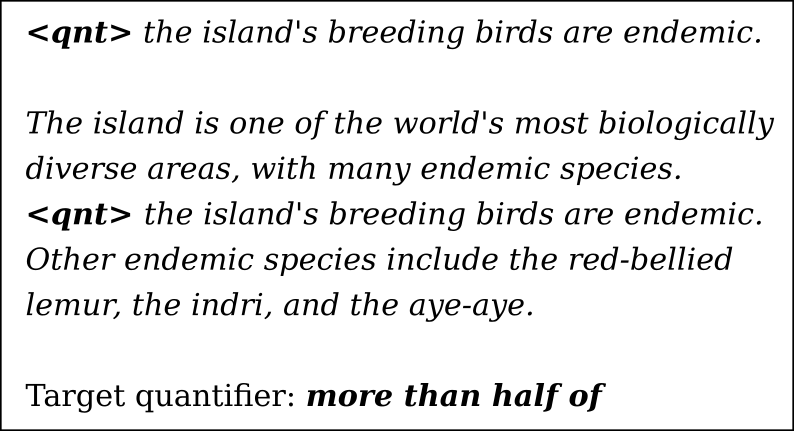

# fill-in-the-quant
Codes and data used in Pezzelle, Steinert-Threlkeld, Bernardi, Szymanik (2018). "Some of Them Can be Guessed! Exploring the Effect of Linguistic Context in Predicting Quantifiers"
Proceedings of ACL 2018

word2vec embeddings (Mikolov et al., 2013) pretrained on GoogleNews can be downloaded from here:

[word2vec GoogleNews vectors](http://bit.ly/1VxNC9t)

For questions, additional info, feedback please contact:
sandro.pezzelle@unitn.it
